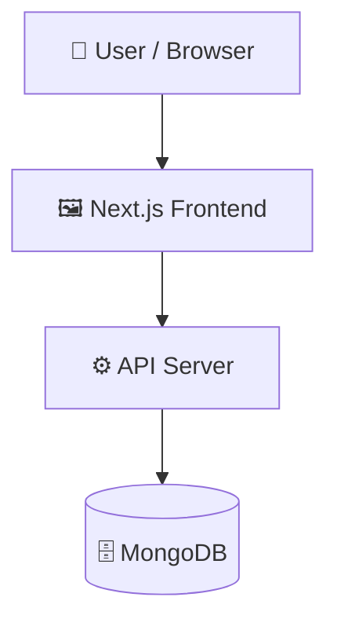

# KeyCoachAI

> AI-powered typing coach for real-time keystroke analysis and personalized exercises.

   

---

## 📑 Table of Contents

- [Description](#-description)
- [Key Features](#-key-features)
- [Use Cases](#-use-cases)
- [Tech Stack](#️-tech-stack)
- [Architecture](#️-architecture)
- [Quick Start](#-quick-start)
- [Development Setup](#️-development-setup)
- [Key Dependencies](#-key-dependencies)
- [Available Scripts](#-available-scripts)
- [API Endpoints](#-api-endpoints)
- [Project Structure](#-project-structure)
- [Contributors](#-contributors)
- [Contributing](#-contributing)
- [License](#-license)

---

## 📝 Description

KeyCoachAI is a full-stack web application designed to help users improve their typing performance through real-time keystroke analysis. By evaluating typing speed, accuracy, rhythm, error patterns, and hand balance, the application identifies specific weak spots and delivers targeted AI-driven coaching to build typing consistency.

Built with Next.js, TypeScript, and Tailwind CSS, the platform connects to a MongoDB database via Mongoose to store performance metrics and session history. Authentication is managed through NextAuth, with Zod handling data validation across application workflows.

---

## ✨ Key Features

- **⌨️ Real-Time Keystroke Analysis** — Monitors speed, accuracy, error rates, rhythm, and hand balance during live typing sessions.
- **🎯 Targeted AI Practice Exercises** — Generates customized typing passages aimed at eliminating specific character and rhythm weak points.
- **📈 Performance Trend Tracking** — Records and visualizes typing metrics over time to measure improvement and consistency.
- **🔐 Session and User Authentication** — Provides secure user account management and profile state persistence powered by NextAuth.
- **🗄️ MongoDB Data Persistence** — Stores user typing data, passages, and analytical history using structured Mongoose models.

---

## 🎯 Use Cases

- Practicing keyboard typing with real-time feedback on speed and accuracy.
- Diagnosing and correcting specific keystroke weaknesses and unbalanced hand usage.
- Tracking personal typing speed (WPM) and accuracy improvements over multiple sessions.
- Accessing personalized, generated passages tailored to specific error patterns.

---

## 🛠️ Tech Stack

   

- **Database ODM**: Mongoose
- **Authentication**: NextAuth
- **Validation**: Zod
- **Visualization & UI Components**: Recharts, Lucide React

---

## 🏗️ Architecture

A high-level view of how the main pieces fit together:



---

## ⚡ Quick Start

```bash
# 1. Clone the repository
git clone https://github.com/maghfoormalkana/KeyCoachAI.git

# 2. Navigate to project directory
cd KeyCoachAI

# 3. Install dependencies
npm install

# 4. Start the dev server
npm run dev
```

---

## 🛠️ Development Setup

### Prerequisites
- **Node.js**: v18+ recommended
- **Package Manager**: `npm` (or `yarn` / `pnpm` / `bun`)
- **MongoDB**: Local instance or MongoDB Atlas connection string

### Setup Steps
1. Install Node.js (v18+ recommended).
2. Install dependencies:
   ```bash
   npm install
   ```
3. Configure your environment variables if needed:
   ```bash
   # <!-- TODO: Add required environment variables (e.g., MONGODB_URI, NEXTAUTH_SECRET) to a .env.local file -->
   ```
4. Start the development server:
   ```bash
   npm run dev
   ```
5. Open `http://localhost:3000` in your browser.

---

## 📦 Key Dependencies

| Package | Version |
| :--- | :--- |
| `next` | `^14.0.0` |
| `react` | `^18.2.0` |
| `react-dom` | `^18.2.0` |
| `typescript` | `^5.3.0` |
| `@types/react` | `^18.2.0` |
| `@types/node` | `^20.0.0` |
| `tailwindcss` | `^3.4.0` |
| `postcss` | `^8.4.0` |
| `autoprefixer` | `^10.4.0` |
| `lucide-react` | `^0.300.0` |
| `recharts` | `^2.10.0` |
| `mongoose` | `^8.0.0` |
| `next-auth` | `^4.24.0` |
| `bcryptjs` | `^2.4.3` |
| `jsonwebtoken` | `^9.0.2` |

---

## 🚀 Available Scripts

| Command | Description |
| :--- | :--- |
| `npm run dev` | Starts the Next.js development server. |
| `npm run build` | Builds the application for production deployment. |
| `npm run start` | Runs the built Next.js production server. |
| `npm run lint` | Runs ESLint to inspect and catch code issues. |

---

## 🌐 API Endpoints

Detected endpoints across application routes:

### Admin
- `POST /api/admin/settings`
- `GET /api/admin/test-connection`
- `POST /api/admin/verify`

### AI Coach
- `POST /api/ai-coach/practice`
- `GET /api/ai-coach`

### Authentication
- `ALL /api/auth/[...nextauth]`
- `POST /api/auth/register`

### Passages
- `GET /api/passages/[id]`
- `POST /api/passages/ai-practice`
- `GET /api/passages/categories`
- `POST /api/passages/generate`
- `POST /api/passages/quick-generate`
- `GET /api/passages`
- `POST /api/passages/seed`

### User & Analytics
- `POST /api/save-result`
- `GET /api/user/stats`

---

## 📁 Project Structure

```text
.
├── app
│   ├── about
│   │   └── page.tsx
│   ├── admin
│   │   ├── login
│   │   │   └── page.tsx
│   │   ├── page.tsx
│   │   └── passages
│   │       └── page.tsx
│   ├── api
│   │   ├── admin
│   │   │   ├── settings
│   │   │   │   └── route.ts
│   │   │   ├── test-connection
│   │   │   │   └── route.ts
│   │   │   └── verify
│   │   │       └── route.ts
│   │   ├── ai-coach
│   │   │   ├── practice
│   │   │   │   └── route.ts
│   │   │   └── route.ts
│   │   ├── auth
│   │   │   ├── [...nextauth]
│   │   │   │   └── route.ts
│   │   │   └── register
│   │   │       └── route.ts
│   │   ├── passages
│   │   │   ├── [id]
│   │   │   │   └── route.ts
│   │   │   ├── ai-practice
│   │   │   │   └── route.ts
│   │   │   ├── categories
│   │   │   │   └── route.ts
│   │   │   ├── generate
│   │   │   │   └── route.ts
│   │   │   ├── quick-generate
│   │   │   │   └── route.ts
│   │   │   ├── route.ts
│   │   │   └── seed
│   │   │       └── route.ts
│   │   ├── save-result
│   │   │   └── route.ts
│   │   └── user
│   │       └── stats
│   │           └── route.ts
│   ├── auth
│   │   ├── signin
│   │   │   └── page.tsx
│   │   └── signup
│   │       └── page.tsx
│   ├── dashboard
│   │   └── page.tsx
│   ├── globals.css
│   ├── icon.png
│   ├── layout.tsx
│   ├── page.tsx
│   ├── practice
│   │   └── page.tsx
│   └── typing-test
│       └── page.tsx
├── components
│   ├── auth
│   │   ├── AuthProvider.tsx
│   │   └── UserButton.tsx
│   ├── footer.tsx
│   ├── navbar.tsx
│   └── typing
│       └── VirtualKeyboard.tsx
├── icon.png
├── lib
│   ├── mongodb.ts
│   ├── omniroute.ts
│   ├── performanceAnalyzer.ts
│   └── utils.ts
├── logo.png
├── middleware.ts
├── models
│   ├── Passage.ts
│   ├── Settings.ts
│   ├── TypingResult.ts
│   └── User.ts
├── next-env.d.ts
├── next.config.js
├── package.json
├── postcss.config.js
├── public
│   └── logo.png
├── tailwind.config.ts
├── test-omniroute.js
├── test-passage.js
├── testPassage.js
├── tsconfig.json
└── types
    ├── index.ts
    └── performance.ts
```

---

## 👥 Contributors

Thanks to everyone who has contributed to this project:

<p align="left">
<a href="https://github.com/maghfoormalkana" title="maghfoormalkana"></a>
</p>

[See the full list of contributors →](https://github.com/maghfoormalkana/KeyCoachAI/graphs/contributors)

---

## 👥 Contributing

Contributions are welcome! Here's the standard flow:

1. **Fork** the repository
2. **Clone** your fork: `git clone https://github.com/maghfoormalkana/KeyCoachAI.git`
3. **Branch**: `git checkout -b feature/your-feature`
4. **Commit**: `git commit -m 'feat: add some feature'`
5. **Push**: `git push origin feature/your-feature`
6. **Open** a pull request

Please follow the existing code style and include tests for new behavior where applicable.

---

## 📄 License

<!-- TODO: Add license details if applicable (e.g. MIT License) -->
This project is distributed under the project repository terms.